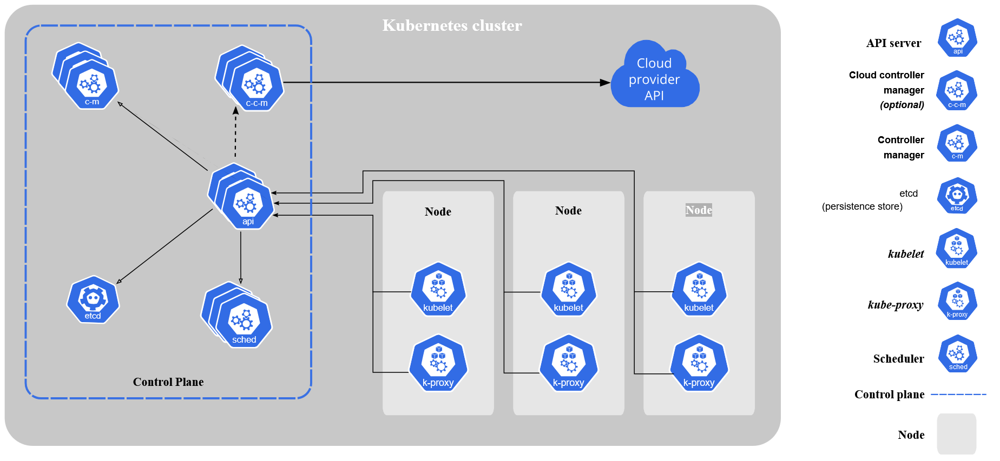

# **`Docker Containerization and Kubernetes Cluster`**




## **`Volumes`**
| |Named Volumes|Bind Mounts|
|:----|:----|:----|
|Host Location|Docker chooses|You control|
|Mount Example (using -v)|my-volume:/usr/local/data|/path/to/data:/usr/local/data|
|Populates new volume with container contents|Yes|No|
|Supports Volume Drivers|Yes|No|

    docker run `
    -dp 1234:3000 `
    -w /app -v "$(pwd):/app" `
    todo-app:version `
    sh -c "yarn install && yarn run dev"

`-dp 1234:3000` → detached(background mode) and port routing: traffic from container's port 1234 to the application's, listening on port 3000

`-w /app` → working dir: directory command will execute from

`-v "$(pwd):/app"` → volume: bind-mount host's current dir ⇒ image /app dir

`todo-app:version` → base image for application

`sh -c "yarn install && yarn run dev"` → alpine doesn't have bash, so we use the *base shell* **sh** to install all dependencies(npm install) and run the *app-start* script(npm run.exe dev). **dev** starts **nodemon**

<sub>**nodemon** is a node.js based tool that automatically relaunches apps upon changes

## **`Container Networking`**

Allows isolated containers running of the same network to talk to each other. Different network containers *cannot* communicate

### **Change base SQLite to MySQL**

### **Start MySQL**
1. Assign at start 

or

2. Connect an existing container

<sub>Create network → **attach MySQL at start**

`docker network create todo-app`

    docker run -d `
     --network todo-app  `
     --network-alias mysql `
     -v todo-mysql-data:/var/lib/mysql `
     -e MYSQL_ROOT_PASSWORD=secret `
     -e MYSQL_DATABASE=todos `
     mysql:5.7

**Create MySQL Container:**

    docker run --detach `
    --network todo-app `
    --network-alias mysql `
    --volume todo-mysql-data:/var/lib/mysql `
    --env MYSQL_ROOT_PASSWORD=secret `
    --env MYSQL_DATABASE=todos `
    mysql:5.7

## **`Connect to database and enter password _secret_`**

`docker exec -it container_id mysql -u root -p`

`SHOW DATABASES;`

    docker exec 

### **Connect to MySQL**

Usefull tools for troubleshooting and debugging network issues

    docker run --interactive --tty --network todo-app nicolaka/netshoot

    dig mysql

**`A record`** for **mysql**(network alias) resolves to an IP address. Application can communicate with MySQL database container by simply connecting to host _named_ **mysql**

### **Run app with MySQL**

This app supports setting of a few env variables for MySQL connection settings

**MYSQL_HOST** → host running MySQL server

**MYSQL_USER**

**MYSQL_PASSWORD**

**MYSQL_DB** → database to use once connected

or 

**MYSQL_PASSWORD_FILE** → for a secure way to reference secrets from the container itself, avoiding the use of environment variables, which can be leaked

<sub>MySQL version8.0 and higher must include:</sub>

    ALTER USER 'root'
    IDENTIFIED WITH mysql_native_password 
    BY 'secret';
    flush privileges
<sub>**docker logs container_id** → information about container </sub>

    docker run -dp 1234:3000 `
    -w /app -v "$(pwd):/app" `
    --network todo-app `
    -e MYSQL_HOST=mysql `
    -e MYSQL_USER=root `
    -e MYSQL_PASSWORD=secret `
    -e MYSQL_DB=todos `
    todo-list:version1.2 `
    sh -c "yarn install && yarn run dev"

 **Check database is working properly:**

    docker exec --interactive --tty `
    <sql-container-id> mysql -p todos

    SELECT * FROM todos.todos_items;

## **`Docker Compose`**

Tool developed to define and share multi-container applications. **Compose** creates a **_yaml_** or _yml_ file to define the services.

With a _yaml_ file, all we need is a single command to power up the app, or destroy it.

**Advantages:**
* compose defines the application stack in a single file
* placed at the root of the project(version controlled) → allows contributions
* use by: cloning repo → start compose app

[**Install Docker Compose..**](https://docs.docker.com/compose/install/)

    docker compose version

### **`Create Compose file`**

At the root of project, create a file named

`docker-compose.yml`

1. Define [schenma version](https://docs.docker.com/compose/compose-file/) → **version: "3.7"**

2. Define services(containers) to run

3. Run docker compose

### **App Services**

**Application Service**: 

Define Service entry and `image` for the container. Pick any name(**`app`**) for the service, Name will become a network alias → useful for MySQL service

Set the `command` to run on the image

Define `ports` for the service

Migrate working directory and volume mapping using `working_dir` and `volumes`

Specify `environment` variables

```yml
version: "3.7"

services:
    app:
        image: todo-list:version1.2
        command: sh -c "yarn install & yarn run dev"
        ports:
            - "1234:3000"
        working_dir: /app
        volumes:
            - ./:/app
        environment:
            MYSQL_HOST: mysql
            MYSQL_USER: root
            MYSQL_PASSWORD: secret
            MYSQL_DB: todos
```

**MySQL Service:**

Name of this db service should match the MYSQL_HOST environment variable of application service `app`

Define **image** and **volume**. 

Volumes **_do not_** get created implicitly from a yml file like they do running a `docker run --volume name:/dir image_id`
<sub>initiates a container with specified volume from image_id</sub>

Volume must be defined in top-level definition section **and** specified in the service's configuration

Define **environment variables**

<sub>`.\docker-compose.yml` - file with contents:</sub>
```yml
version: "3.7"

services:
    app:
        image: node:12-alpine
        command: sh -c "yarn install && yarn run dev"
        ports:
            - "1234:3000"
        working_dir: /app
        volumes:
            - ./:/app
        environment:
            MYSQL_HOST: mysql
            MYSQL_USER: root
            MYSQL_PASSWORD: secret
            MYSQL_DB: todos
    mysql:
        image: mysql:5.7
        volumes: 
            - todo-mysql-data:/var/lib/mysql
        environment:
            MYSQL_ROOT_PASSWORD: secret
            MYSQL_DATABASE: todos
volumes:
    todo-mysql-data:
        external: false
```

### **`Run Application stack`**

Make sure no other copies are running first.

Compose the application

    docker-compose up

Destroy application

    docker-compose down

To remove application **and** volumes used in the app. May not want to do this to maintain persistent database

    docker-compose down --volumes


# **`Kubernetes`**

Highly available cluster of computers connected to work as a single unit.

Automates distribution and scheduling of application containers across a cluster in a more efficient way

    kubectl cluster-info

**Control Plane** → coordinates and **manages cluster**
* Scheduling, maintaining desired state, scaling, roling out updates
* exposes kubernetes API

**Nodes** → are the workers that run applications
* **contains Kubelet** → node manager and middle man for control plane
* *should* have container runtime(Docker)

<sub>**Three node minimum** for production traffic</sub>

**`Deployment`**

To deploy application, Control Plane starts app *containers*. Control schedules containers to run on cluster's nodes. 

Nodes communicate with Control Plane using **kubernetes API**. K-API which is accessible by end users

> **Minikube** - Lightweight Kubernetes implementation that creates a VM on local machine and deploys simple cluster containing 1 node

    kubectl get nodes -o wide

    kubectl describe nodes

### **`Deployment Configuration`**

Instructs Kubernetes how to create and update instances of application. 

Once created, Control Plane schedules app instances included in deployment to run on individual Nodes in the cluster

Created app instances are continuously monitored by **Kubernetes Deployment Controller**

If a Node crashes, Controller replaces instance with another Node in the cluster, providing **self-healing** and addressing machine failure or maintenance

<sub>Before orchestration tools, scripts in vms were used to start applications. Recovery from machine failure was not allowed. Kubernetes Deployments provide a * fundamentally* different approach to application management


*Applications need to be packaged into one of the supported container formats in order to be deployed on Kubernetes*

**kubectl** → Kubernetes API → interact with cluster

Deployment creation specifies the container image for application, and the number of replicas.

```bash
kubectl create deployment <name> --image=<container:image:version>

kubectl create deployment <todo-list> --image=adriannoa91/todo-list:v1

kubectl get deploy --output wide

kubectl describe deploy 

export POD_NAME=$(kubectl get pods -o go-template --template '{{range .items}}{{.metadata.name}}{{"\n"}}{{end}}')

$NODE_PORT=(kubectl get services/bootcamp -o go-template='{{(index .spec.ports 0).nodePort}}')   
```

### **`Pods`**

Upon deployment, a **Pod** that hosts app is created. 

It is an *abstraction* that represents a group of one or more application containers, and shared resources
* Volumes - storage
* Networking - unique cluster IP address
* Information - how to run each container. Image version and ports

Pod models an application-specific **logical host** and con contain different application containers which are relatively tightly coupled.

Pod might include both container with Node.js app as well as a different container that feeds the data to be publised by the Node.js webserver.

Containers in a Pod share an IP Address and port space, they are co-located and co-scheduled, running in a shared context on the same Node.

Pods are the atomic unit on Kubernetes platform.

**Deployment** to Node → creates Pods → hold Containers

<sub>Each Pod is tied to the Node where it is scheduled, and remains there until termination or deletion. In case of failure, Deployment Controller schedules identical pods on other available Nodes</sub>


<sub>**Containers** should only be **scheduled together** in a **single Pod** if they are **tightly coupled** and **share resources**</sub>

## **`Nodes`**

Pods run on Nodes.

Nodes are **worker** machines in either virtual or physical machine, depending on cluster

Nodes can have **multiple** Pods.

Nodes are **managed** by *Control Plane*

**Control Plane automatically** handles scheduling of Pods across the Nodes in the cluster.

Control Plane automatic scheduling accounts for available resources on Nodes

Kubernetes Nodes run:
* **Kubelet** - process responsible for comms. between Control Plane ⇔ Node
* **Container runtime** - pulling images from registry, unpacking container, running app


**Get Pod Names**

    kubectl get pod -o name

**Get Pod Name from label**

    kubectl get pod --label app=todo -o name
    kubectl get pod -l app=todo -o name

    $POD_NAME=(kubectl get pod -l app=todo -o jsonpath="{.items[0].metadata.name}")

**List of pods by name**

    $arr= -split (kubectl get pods -o go-template --template '{{range .items}} {{.metadata.name}}{{end}}')

**Get pod name from array and log**

    $POD_NAME=$arr[i]

    kubectl logs $POD_NAME

**Shell into container**

    kubectl exec -ti <pod_name> -- bash
    kubectl exec --tty --stdin $arr[0] -- bash

    find . | grep FileFolderName

**To grab pseudo Dockerfile from image**

    $arr = docker history --no-trunc todo-list:v1

    for ($i = 0 ; $i -le $arr.count-1 ; $i++) {
        $arr[$i] = -split $arr[$i]
        $arr[$i] = $arr[$i] -join " "
    }

    $arr

Pods have a lifecycle. When a worker Node dies, so do the Pods within.

ReplicaSets drives cluster back to desired state by creating new pods automatically

## **`Using a Service to expose App`**

A Service is an abstraction which defines a logical set of Pods and a policy by which to access them

Defined using **YAML** or json. 

**Pods** in a Node targeted by Service are *usually determined* by a **LabelSelector**. 

```yaml
    kind: Pod
    metadata:
      name: myappname
      labels:         # key value pair label
          app: todoapp

    kind: Service
    spec:             # applies service to any 
      selector:       # pod or deployment with
        app: todoapp  # same key value pair labels
```

<sub>**Service without Selector → no Endpoint**</sub>

This type of service requires manual mapping of Service to specific Endpoints. 

ExternalName type of Services do not specify a selector

A **Pod's** unique **IP adress** are **not exposed** outside cluster **without a Service**

### **`ClusterIP`**

Accessible only within cluster. To test: 
1. sh into nodejs → `kubectl exec -ti podname -- sh`
2. install curl package → `apk --no-cache add curl`
3. get url with either method
   * **A** <clusterInternal-IP\>:<port\>
   * **B** <podInternal-IP\>:<targetPort\>

When **only** `port` is specified and App listens on port 3000

Service port set to 80

Site is only available within **pods**(any) in the cluster using **method B** on app's listening port `<podIP>:3000`

```yaml
# port assigned: 31234
type: ClusterIP
ports:
- port: 80
```
When port is set to the app's `listening port` 3000

Site is available from
**method A** `<clusterIP>:3000` and
**method B** `<podIP>:3000`

```yaml
# port assigned: 31234
type: ClusterIP
ports:
- port: 3000
```
`port` refers to the **container's port**, in this case the **cluster**

`targetPort` refers to the **pod's traffic port**

Service `port` is set to 80(default) and `targetPort` is set to 3000

Site is available from
**method A** `<clusterIP>` and
**method B** `<podIP>:3000`

```yaml
# port assigned: 31234
type: ClusterIP
ports:
- port: 80
  targetPort: 3000
```

### **`Load Balancer`**

When **only** `port` is specified, `targetPort` is set to the same value as port

Simple applications listens on port 3000, Service's port is set to 3000

open app → https://localhost:3000
```yaml
# App listens and serves on the same port
ports:
  - port: 3000
type: LoadBalancer
```
When **port** and **nodePort** are specified

Simple app listen on port 3000, targetPort is set to 3000, port is set to 80

open app → https://localhost:80 → https://localhost

```yaml
# app listens on port 3000, servers on 80(default)
type: LoadBalancer
ports:
- port: 80
  targetPort: 3000
```

### **`NodePort`**

When **only** `port` is specified, a random ephemoral port is assigned to `nodePort`

Simple app listen on port 3000, Service's port is set to 3000

open app → https://localhost:31234

```yaml
# port assigned: 31234
type: NodePort
ports:
- port: 3000
```
open app → https://localhost:31777

```yaml
type: NodePort
ports:
- port: 3000
  nodePort: 31777
```


Type of Services:
1. **LoadBalancer** → Creates an external balancer in current cloud and assigns a fixed external IP to the Service. Superset of NodePort
2. **NodePort** → Superset of CLusterIP Exposes Service on the same port of each selected Node in the cluster using NAT. Accessible from outside cluster <NodeIP\>:<NodePort\>. 
3. **ClusterIP** → default. Exposes the Service within cluster only
4. **ExternalName** → Maps the service to the contents of the externalName field www.some-site.net, by returning a CNAME record with its value. No proxying required. v1.7 kube-dns required, or CoreDNS 0.0.8


A **`Service`** routes traffic across a set of Pods specified by selector.

Services are the abstraction that allows Pod replication without impacting app.

**Discovery** and **routing** among dependent Pods is handled by **Services**

**Services** match set of Pods using *labels* and *selectors*.

Labels are key/value pairs attached to objects, used for:
* Designate objects for dev, testing, or production
* Embed version tags
* Classify an object using tags

**Label** can be attached at creation, or modified later on. 


## **`Updating pods and deployments: Rolling Updates`**

Rolling updates allow Deployments/Pod updates to take place without *zero downtime*

By default, the maximum amount of downtime pods and pods that can be created **is one(1)**

